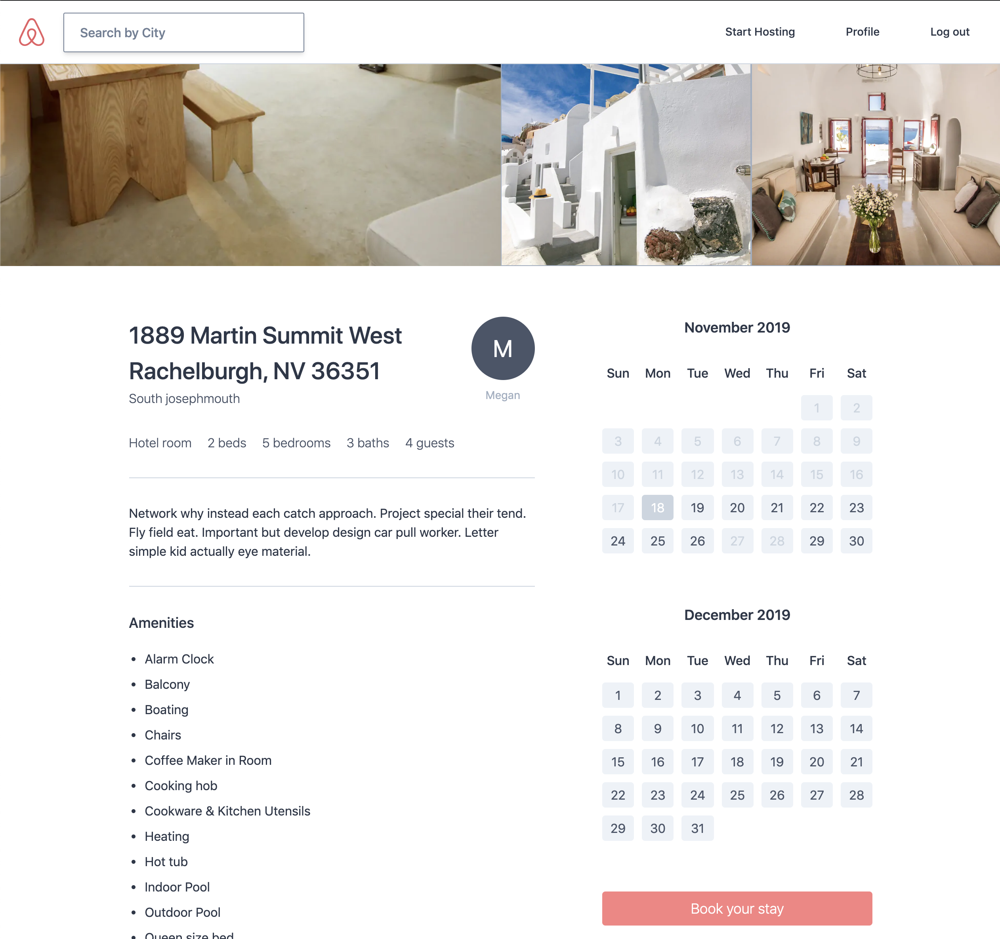

# Airbnb Clone

-   Django v2.2

## Styling

-   Tailwind CSS

## Email

-   Mailgun

## OAuth

-   GitHub
-   Kakao

## Deployment

-   AWS EB & RDS (PostgreSQL)

## App Monitoring

-   Sentry

## Screenshots

<kbd>
    
</kbd>
 
 
<kbd>
    
</kbd>
 
 
<kbd>
    
</kbd>
 
 
<kbd>
    
</kbd>
 
 
<kbd>
    
</kbd>
